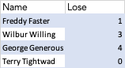

# Tombola

Weihnachtstombolaspiel

Spiel zur Ziehung der Weihnachtstombola für eXXcellent solutions
NB: Beim spielen auch sound teilen in Teams.

Code and music copyright David Jenkins, 2020, except works by Dark Fantasy Studio, copyright Nicolas Jeudy / DARK FANTASY STUDIO 

All rights reserved 

## Setup

1. Create a virtual environment. If on Windows, run the following
```
pip install virtualenv       # Skip if already installed.
cd Tombola
virtualenv venv
```
2. Install dependencies
```
source ./venv/Scripts/activate
pip install -r requirements
```

## Input
Parameters 
```
-i lose_file -p prizes_file
```
[-i] Pfad zur Excel-Datei, die die Namen und Lose enthält. e.g.

```
python adventure.py -i "../eXXcellent/Weihnachtsfeier/TombolaLose.xlsx
```
The format of the Excel is very simple. Two columns, headed `Name` and `Lose` hold the name to display
for the player, and the number of lives they have (= number of tickets, i.e. Lose, they bought)



[-p] Pfad zur .txt-Datei, die die Preise enthält (einen pro Zeile). Die Anzahl der Preise bestimmt die Anzahl der Gewinner.

## Output

File **winners.txt** contains the list of winners

## If things go wrong

```
( All settings in adventure.py)
```

Parameter 
```
MOVEMENT_SPEED = 5
```

controls Mabel's speed. If everybody buys lots of lives, then it may be advisable to speed up Mabel to get through the game quicker.

If only 15 coins appear, debug mode is set. Check function
```
is_debug()
```
to see if it has been set to permanently return true.